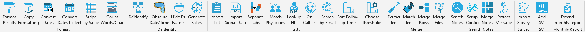
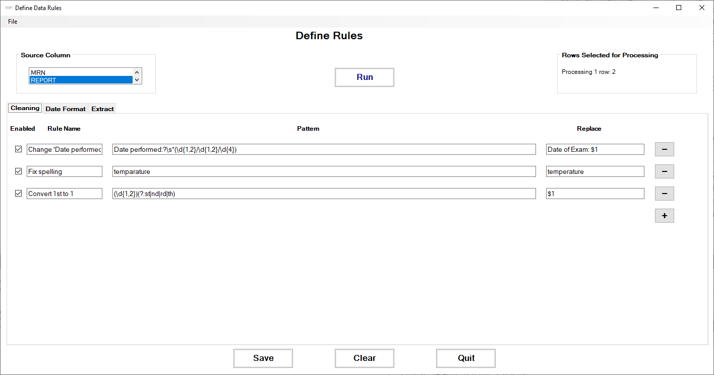
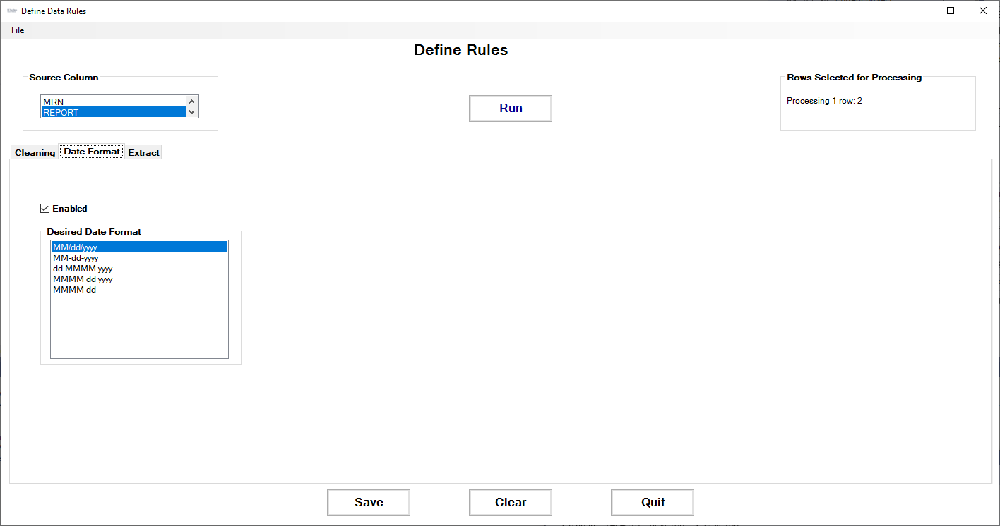
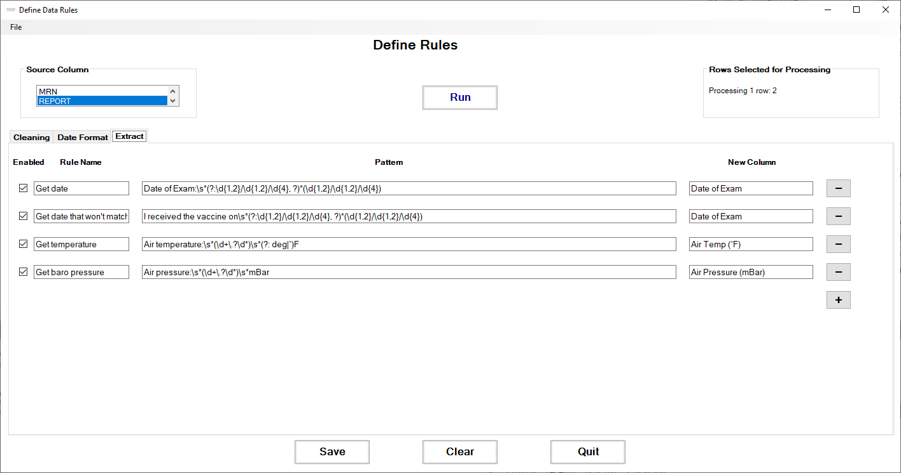
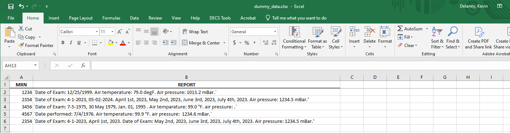
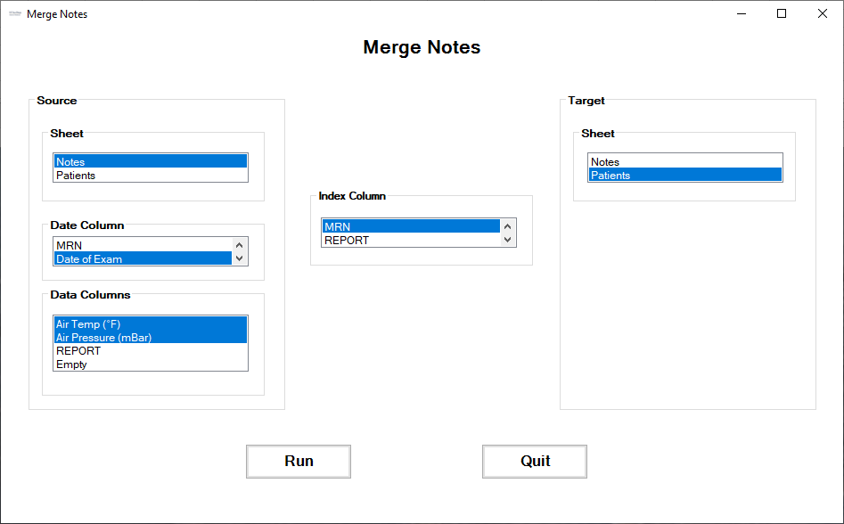

# Excel Add-Ins

 

Creates custom buttons in Microsoft Excel that allow user to:
* Format a page of results with bold & centered header, NULLs grayed out, etc.
* Copy the formatting from one sheet onto the next sheet(s).
* Convert dates from [MUMPS](https://en.wikipedia.org/wiki/MUMPS) to Excel standard.
* Highlight blocks of data.
* Generate unique, scrambled identifiers from patient or user data.
* Dither dates/times to deidentify patients.
* Turn a list (of MRNs, ICD codes, etc.) into a SQL snippet that imports the column into a query.
* Break up a long spreadsheet into individual sheets, using the value of one column.
* Process a physician oncall list into SQL code for import.
* Search UCSD Blink for provider names using email addresses.
* Turn text like "2-3 weeks" into a category like "routine/medium/high" [priority].
* Set thresholds for text parsing into priorities.
* Merge rows across dates.
* Extract the payload from a message.
* Scan `Notes` fields for keywords, creating new columns.
* Merge notes from one sheet into another according to some index column (like CSN).
* Convert patient satisfaction survey data into SQL format.
* Lookup Social Vulnerability Index ([SVI](https://www.atsdr.cdc.gov/placeandhealth/svi/index.html)) from address or zip code.
* Extend the existing monthly research hours report to the new month.

## Installation
* Download the `Office Add-Ins` folder from [Sharepoint.](https://ucsdhs.sharepoint.com/:f:/t/ACTRI-BMI-DECSPrivate/EhFYD_9zfX9GsNRN9enCMzABFKg6wmPh13zY_ps2qRJHSg?e=KYFZeG)
* Run `setup.exe`.

## Operation
### Excel: Extract data from notes
In cases where we want to extract data from free-text columns, we can use the `Notes` tools to define & run extraction rules.
#### Cleaning
We start in the `Cleaning` tab, defining cleaning rules to:
* fix misspellings
* enforce standard naming

These rules are run *before* the data extraction rules.

#### Date formats
Using the `DateFormat` tab, we can select which date format we want for output columns.

#### Extraction rules
The `Extract` tab lets us define the Regular Expressions that extract data from free text.

Starting with these free-text notes:

Here's an example of the extracted data:

Notice how the original dates--in multiple formats--were automatically converted to a standard date format before extraction.

### Excel: Merge notes from different sheets
In complex data sets, we may have extracted data in pieces and now need to merge results from one sheet into another. However, the index value (like **C**ontact **S**erial **N**umber) may be present on more than one row, or may be missing. And in the case of data extracted from notes, there may be different values extracted from different patient visits.

Clicking the `Merge Notes` button brings up this dialog to define the source of the data, into which sheet it's to be merged and which column (if any) defines the date at which the data were measured:

### Word: Build List Import
When researchers provide lists of Medical Record Numbers (MRNs) or International Classification of Diseases (ICD) codes to be used in a report, those lists need to be imported into SQL. Pressing the `Import List` button converts a list into SQL code which can be referenced in a query to import them:

Since there is a limit on the number of values (1000) that can be inserted in one statement, the app automatically breaks up the insertion into multiple statements:

## Algorithm Description
### Excel: Lookup Social Vulnerability Index (SVI)
Researchers sometimes ask for the [Social Vulnerability Index](https://www.atsdr.cdc.gov/placeandhealth/svi/index.html) of a patient's neighborhood in order to provide a fuller picture of their [social determinants of health](https://health.gov/healthypeople/priority-areas/social-determinants-health). According to the US Centers for Disease Control's Agency for Toxic Substances and Disease Registry (CDC/ATSDR):

> Social vulnerability refers to the potential negative effects on communities caused by external stresses on human health. Such stresses include natural or human-caused disasters, or disease outbreaks. Reducing social vulnerability can decrease both human suffering and economic loss.

We can provide this information by using the patient's address (preferred) or zip code to look up their [census tract number](https://www.census.gov/programs-surveys/geography/about/glossary.html#par_textimage_13), then retrieving their SVI info from a [document](https://www.atsdr.cdc.gov/placeandhealth/svi/data_documentation_download.html) published by the CDC/ATDSR, which lists the SVI information for each census tract (called a [Federal Information Processing Standard (FIPS)](https://nitaac.nih.gov/resources/frequently-asked-questions/what-fips-code-and-why-do-i-need-one#:~:text=The%20Federal%20Information%20Processing%20Standard,equivalents%20in%20the%20United%20States.) code in the data files).

#### Finding the census tract number:
**Address**
If we have a patient's address, the app looks up their exact census tract number using the US Census Bureau's [online geocoding service](https://geocoding.geo.census.gov/geocoder/Geocoding_Services_API.html). Here's an example of the query & response (the census tract number is here called *GEOID*):

Query:
https://geocoding.geo.census.gov/geocoder/geographies/onelineaddress?address=1600%20PENNSYLVANIA%20AVE%2C%20WASHINGTON%20DC%2020500&benchmark=2020&vintage=2020&format=json

Response:

**Zip code**
Using just a zip code is less exact than a full address, as a zip code may contain many census tracts, and tracts may overlap with more than one zip code. So the app uses [*crosswalk*](https://www.huduser.gov/portal/datasets/usps_crosswalk.html) files provided by the US Department of Housing and Urban Development to lookup all the census tracts present in a given zip code. Here's an example from the file ZIP_TRACT_122023.csv (available [here](https://www.huduser.gov/portal/datasets/usps_crosswalk.html)). Notice the large number of census tracts which cross to a typical San Diego County zip code:

#### Extracting SVI information
The data files published by CDC/ATDSR have one row of social vulnerability data for each census tract. The meaning of each column is explained [here](https://www.atsdr.cdc.gov/placeandhealth/svi/documentation/SVI_documentation_2020.html); we extract the column SPL_THEMES as the SVI score, and RPL_THEMES as the SVI ranking. While both single-state and entire-USA files are available, we've used the entire-USA file to be able to provide data both within & outside of California. If single-state files are used, please review the section *Caveat for SVI State Databases* in [SVI documentation](https://www.atsdr.cdc.gov/placeandhealth/svi/documentation/SVI_documentation_2020.html) for important statistical concerns.

Here's an example of the SVI data from file SVI_2020_US.csv (available [here](https://www.atsdr.cdc.gov/placeandhealth/svi/data_documentation_download.html)) for the census tract 11001980000 returned in the example query above:

In cases where we're using only zip code information and have multiple census tracts, the app returns the average SVI score and ranking across all tracts associated with the zip code.

