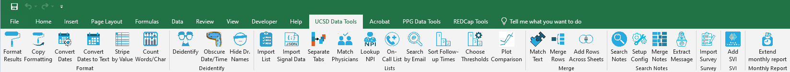

# Excel Add-Ins

 

Creates custom buttons in Microsoft Excel that allow user to:
* Format a page of results with bold & centered header, NULLs grayed out, etc.
* Copy the formatting from one sheet onto the next sheet(s).
* Convert dates from [MUMPS](https://en.wikipedia.org/wiki/MUMPS) to Excel standard.
* Convert dates to text format for easier import into R.
* Highlight blocks of data.
* Count words & characters.
* Generate unique, scrambled identifiers from patient or user data.
* Dither dates/times to deidentify patients.
* Replace physicians names with randomized code number.
* Turn a list (of MRNs, ICD codes, etc.) into a SQL snippet that imports the column into a query.
* Import Epic Signal data from `.json` file.
* Break up a long spreadsheet into individual sheets, using the value of one column.
* Match physicians on two separate sheets.
* Process a physician oncall list into SQL code for import.
* Search UCSD Blink for provider names using email addresses.
* Turn text like "2-3 weeks" into a category like "routine/medium/high" [priority].
* Set thresholds for text parsing into priorities.
* Plot comparisons between multiple timeseries.
* [Merge rows](./help%20files/MergeRows/MergeRows.md) across dates.
* Extract the payload from a message.
* [Scan `Notes` fields](./help%20files/SearchNotes/SearchNotes.md) for keywords, creating new columns.
* [Merge notes](./help%20files/MergeNotes/MergeNotes.md) from one sheet into another according to some index column (like CSN).
* Convert patient satisfaction survey data into SQL format.
* [Lookup Social Vulnerability Index](./help%20files/SVI/SVI.md) ([SVI](https://www.atsdr.cdc.gov/placeandhealth/svi/index.html)) from address or zip code.
* Extend the existing monthly research hours report to the new month.
