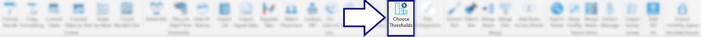
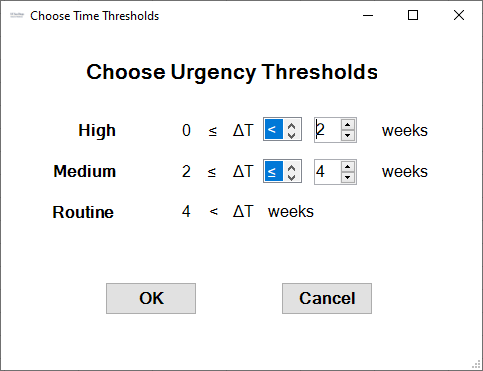

## Choose Thresholds

This tool allows the user to redefine the routine/medium/high urgency category thresholds used in the [Sort Follow-up Times tool](./help%20files/SortFollowUpTimes/SortFollowUpTimes.md).

Pressing the `Choose Thresholds` button brings up this GUI, where the user can redefine the threshold for each urgency category.

[BACK](../../README.md)
