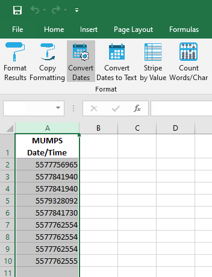
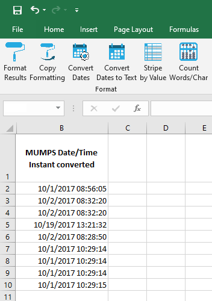

## Convert MUMPS dates to Excel

Some Epic™ systems report dates in [MUMPS format](https://en.wikipedia.org/wiki/MUMPS), which stores dates/times as the number of seconds since 31 December 1840[^1]. These need to be converted to Excel format (fractional days since 01 January 1900) if we are to make sense of them.

Here's an example:

...and the converted values:

[BACK](../../README.md)

[^1]: https://ken-blog.krugler.org/2011/07/15/interesting-dates-in-computer-programming/