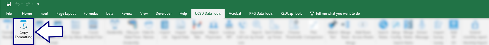
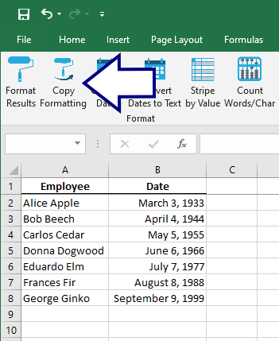
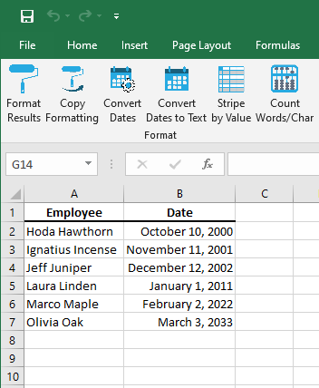

## Copy Formatting

 

In a multi-sheet data set, once you have the first sheet just the way you like it, use this tool to copy the formatting across all the remaining sheets.

Suppose the first sheet looks like this:

 

and the second sheet looks like this:

 

Clicking the `Copy Formatting` button copies all the formatting from the first sheet onto all remaining sheets:

 

[BACK](../../README.md)