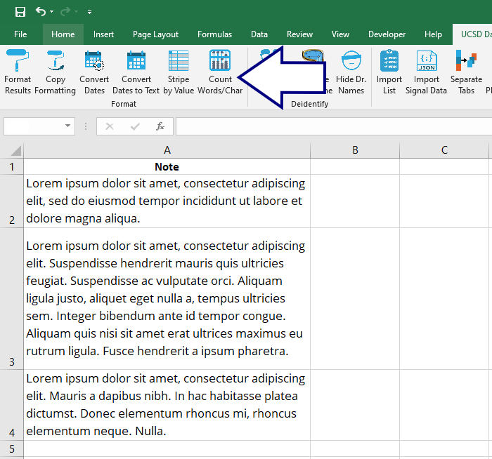
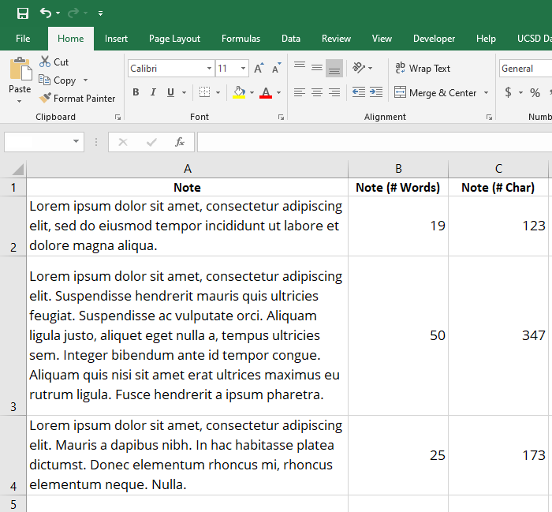

## Count Words/Characters

Sometimes researchers want to count the words or charcters in a column--for example, when assessing the complexity of a patient's message or a physician's reply. 

Using this tool:

...easily creates two new columns with this information:

[BACK](../../README.md)