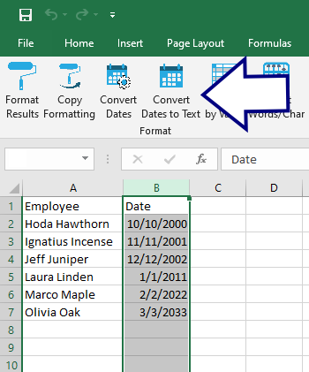

## Convert Dates to Text

Internally, Excel stores dates as ["the number of days elapsed since January 1, 1900"](https://support.microsoft.com/en-us/office/date-systems-in-excel-e7fe7167-48a9-4b96-bb53-5612a800b487). To prevent problems when ingesting Excel dates into software (such as `R`), use this tool:

...which converts the selected column:

...adding a new column with the same dates in text format:

[BACK](../../README.md)