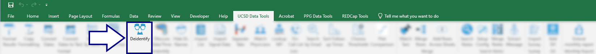
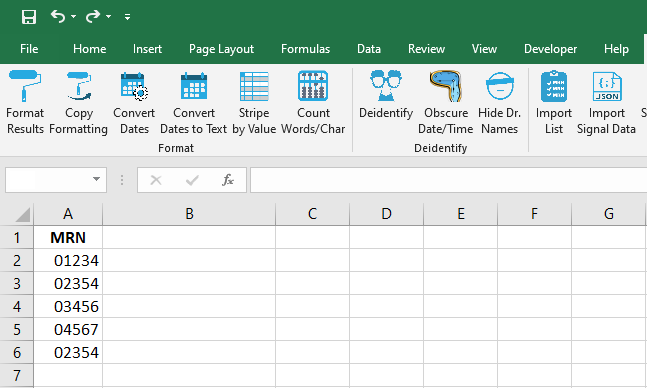
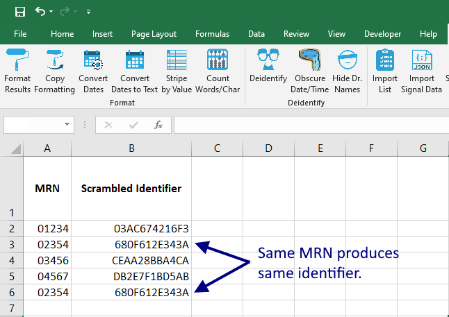
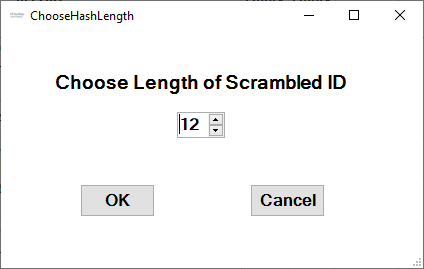

## Deidentify

This tool generates a [SHA256](https://en.wikipedia.org/wiki/SHA-2) hash code from any source information--such as patient Medical Record Number (MRN)--helping to deidentify the spreadsheet rows.

For example, if these data were extracted from the electronic health records:

...pressing the `Deidentify` button generates a scrambled identifier that is tied to the source data (in this case, MRN):

The user can select the desired hash length:

[BACK](../../README.md)