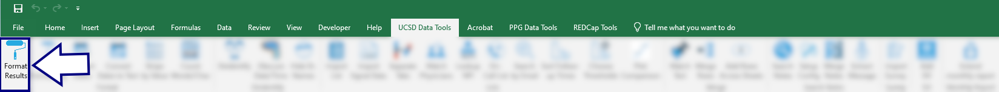
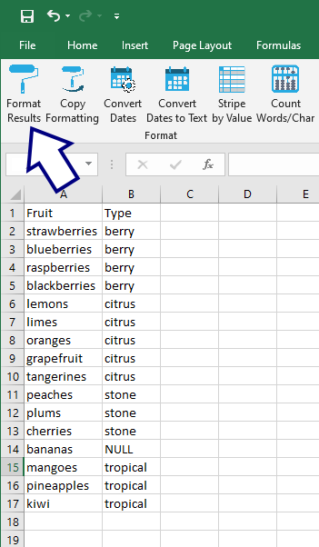
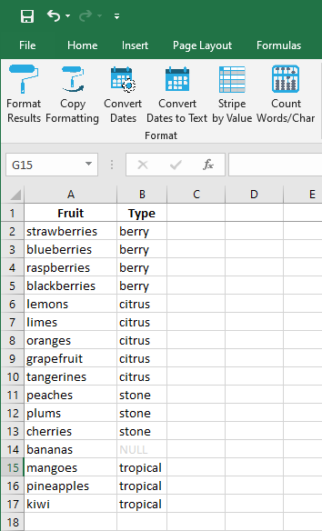

## Format Sheet

This tool provides one-click formatting of the selected sheet:

* Makes header row __bold__ and centered.
* Attempts to auto-adjust column width to fit the data.
* Grays out any `NULL` values.

If the spreadsheet looks like this:

...once formatted, it will look like this:

[BACK](../../README.md)