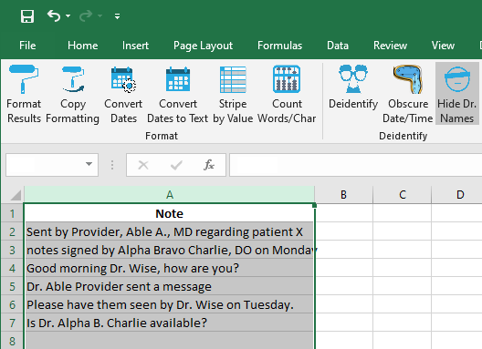
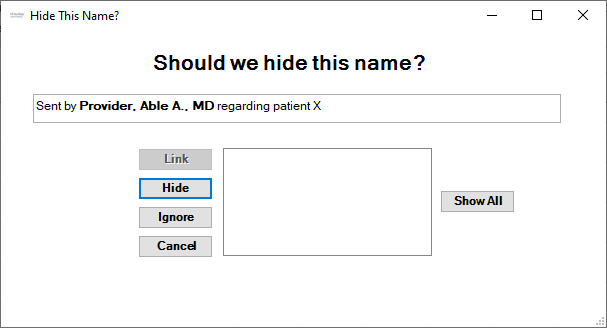
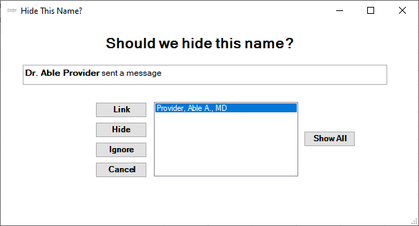
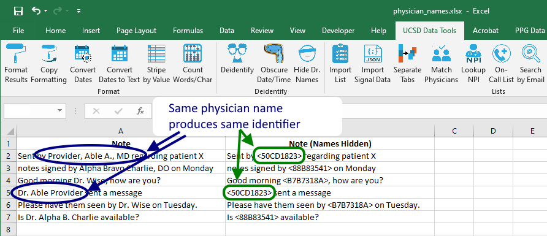

## Hide Dr. Names

In some cases, we want to study patient or physician notes but not reveal the physicians' names. Using this tool, we can search for physician names & replace with a scrambled identifier. If the notes look like this:

...clicking the `Hide Dr. Names` button starts the search. If a string matches one of the app's regular expressions, a GUI asks the user for confirmation:

If the detected name seems like one previously identified, the GUI allows the user to __link__ the two versions:

The processed notes look like this. Note that linking `Provider, Able A., MD` with `Dr. Able Provider` means the same scrambled identifier is used in the two notes. This enables notes mentioning the same physician can be studied as a group.

[BACK](../../README.md)