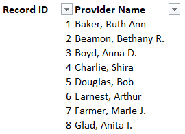
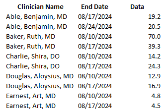
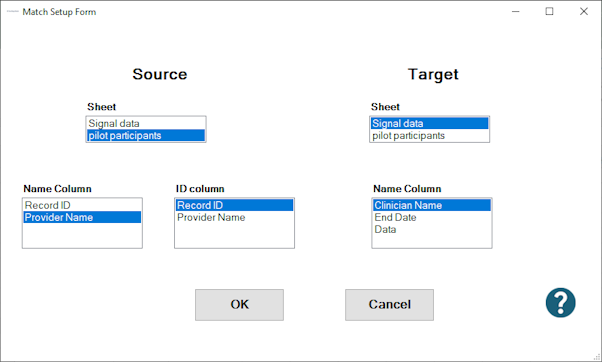
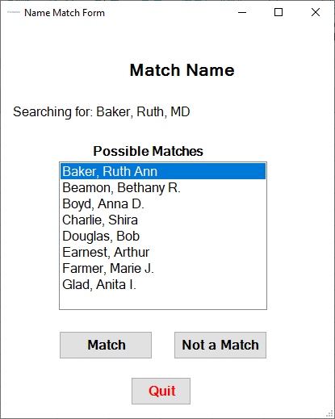
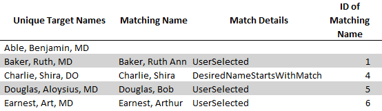

## Physician Matching

In one project, we needed to match physicians' data from [Epic Signal](https://signal.epic.com/?application=1&pageType=1&targetID=607286) with a list of physicians who had signed up as test users for a study. Since the names are not recorded in the same format, this app was developed to match the two lists & insert the ID numbers from the study sign up into the Signal data.

The sign-up list looks like this (showing simulated data).

...while the simulated Signal data look like this:

Once the `Match Physicians` button is pressed, this setup form appears:

Select the sheet containing the sign-up information as `Source` and the Signal data sheet as `Target`. Pressing OK starts the process of matching the names on the two sheets. Where matches can be made automatically, they're entered in a new `Translation  Table` sheet. 

If a name on the `Target` sheet can't be automatically matched, a GUI pops up with possible matches for the user to select from:

Users are encouraged to review the `Translation Table` sheet, edit it as necessary and re-run the app, which will then use those edited name assignments.

