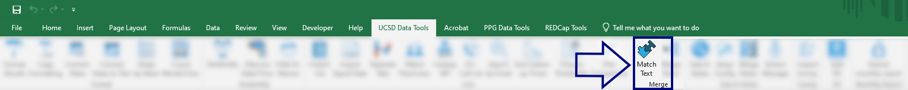
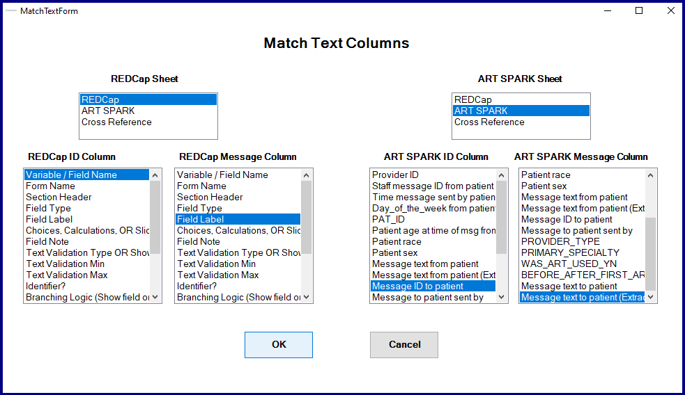

## Match Text

This app finds the message in one column that was derived from the message in another column.  

We begin by selecting the derived text columns (on the left) and original text columns (on the right).

Because the patients' names had been redacted from the one column, there will not be an *exact* match. Instead, we:

* Break up the redacted text at the `<Redacted>` marker, resulting in a `List<string>` object.
* Convert any special characters that were injected into the text.
* Test to see if *all* of the elements of the `List<string>` are present in the source text.

[BACK](../../README.md)