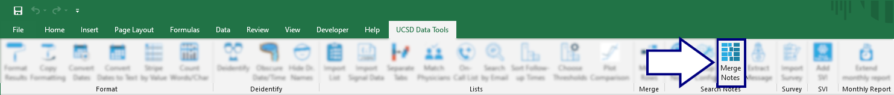
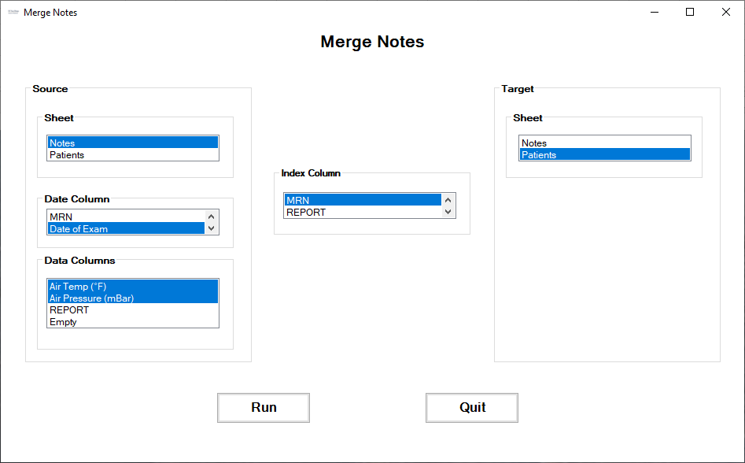

## Merge notes from different sheets

In complex data sets, we may have extracted data in pieces and now need to merge results from one sheet into another. However, the index value (like **C**ontact **S**erial **N**umber) may be present on more than one row, or may be missing. And in the case of data extracted from notes, there may be different values extracted from different patient visits.

Clicking the `Merge Notes` button:

...brings up this dialog to define the source of the data, into which sheet it's to be merged and which column (if any) defines the date at which the data were measured:

[BACK](../../README.md)