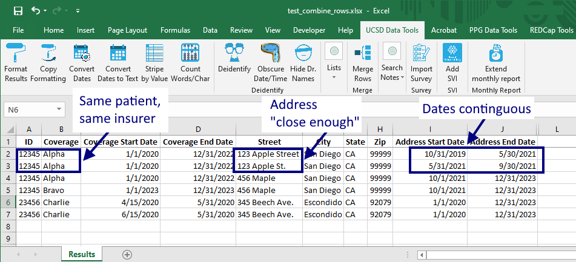
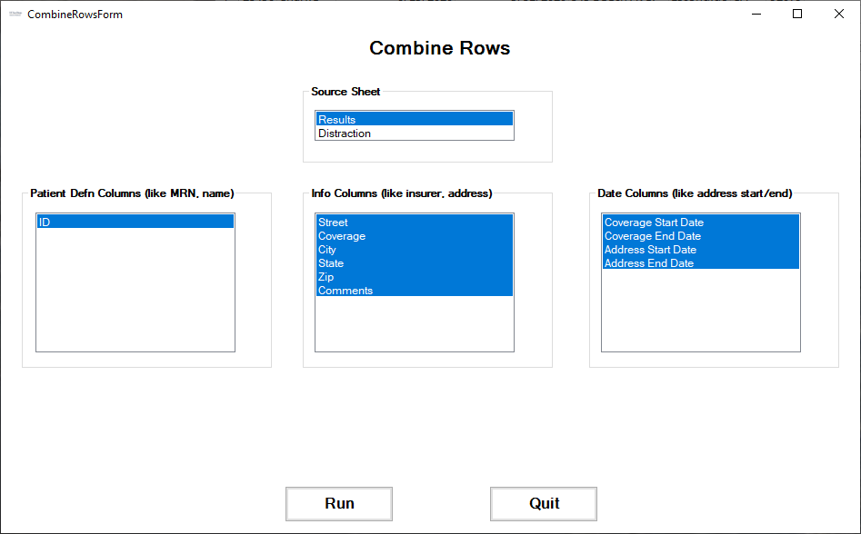
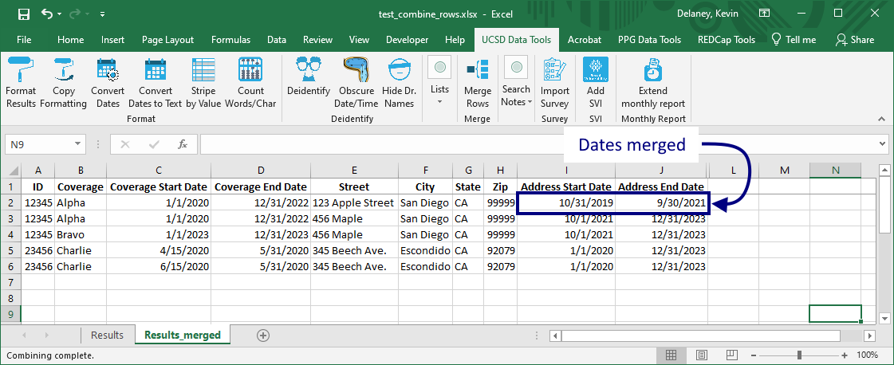

## Merge Rows
Sometimes we want to combine information across several rows. For example, in the file in Figure 1...

<figure>

<figcaption>
Figure 1. Rows that should be merged
</figcaption>
</figure>

...we want to merge rows showing:

* the same patient 
* lived at the same address
* and had the same insurance coverage
* and the dates for insurance and address are either the same or contiguous.

Selecting the `Merge Rows` button:

<figure>

<figcaption>
Figure 2. Selecting the <code>Merge Rows</code> button
</figcaption>
</figure>

...brings up the `MergeRows` form:

<figure>

<figcaption>
Figure 3. <code>Merge Rows</code> form
</figcaption>
</figure>

Here we select the `ID` column as the one which identifies the patient, the `StartDate`, `EndDate` columns as the Date columns and the rest as `Info` columns.

<figure>

<figcaption>
Figure 4. Resulting merged rows
</figcaption>
</figure>

Pressing the `Run` button produces a new sheet, in which rows 2 & 3 of Figure 1 have been merged into one row, using the `Address Start Date` of row 2 and the `Address End Date` of row 3.

Where address changes (as in Figure 4, between rows 2 & 3) or patient changes (Figure 4, between rows 3 & 4) or there is a gap in the dates (Figure 4, `Coverage End Date` on row 5 to `Coverage Start Date` of row 6), the rows are *not* merged.

[BACK](../../README.md)