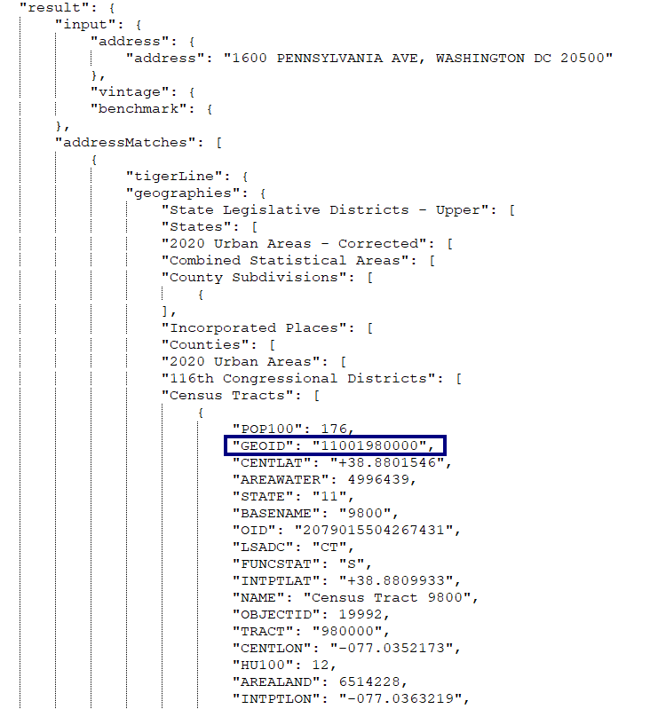

## Lookup Social Vulnerability Index (SVI)


Researchers sometimes ask for the [Social Vulnerability Index](https://www.atsdr.cdc.gov/place-health/php/svi/?CDC_AAref_Val=https://www.atsdr.cdc.gov/placeandhealth/svi/index.html) of a patient's neighborhood in order to provide a fuller picture of their [social determinants of health](https://health.gov/healthypeople/priority-areas/social-determinants-health). According to the US Centers for Disease Control's Agency for Toxic Substances and Disease Registry (CDC/ATSDR):

> Social vulnerability refers to the potential negative effects on communities caused by external stresses on human health. Such stresses include natural or human-caused disasters, or disease outbreaks. Reducing social vulnerability can decrease both human suffering and economic loss.

We can provide this information by using the patient's address (preferred) or zip code to look up their [census tract number](https://www.census.gov/programs-surveys/geography/about/glossary.html#par_textimage_13), then retrieving their SVI info from a [document](https://www.atsdr.cdc.gov/placeandhealth/svi/data_documentation_download.html) published by the CDC/ATDSR, which lists the SVI information for each census tract (called a [Federal Information Processing Standard (FIPS)](https://nitaac.nih.gov/resources/frequently-asked-questions/what-fips-code-and-why-do-i-need-one#:~:text=The%20Federal%20Information%20Processing%20Standard,equivalents%20in%20the%20United%20States.) code in the data files).

#### Finding the census tract number:
**Address**
If we have a patient's address, the app looks up their exact census tract number using the US Census Bureau's [online geocoding service](https://geocoding.geo.census.gov/geocoder/Geocoding_Services_API.html). Here's an example of the query & response (the census tract number is here called *GEOID*):

Query:
```
https://geocoding.geo.census.gov/geocoder/geographies/onelineaddress?address=1600%20PENNSYLVANIA%20AVE%2C%20WASHINGTON%20DC%2020500&benchmark=2020&vintage=2020&format=json
```
Response:



**Zip code**
Using just a zip code is less exact than a full address, as a zip code may contain many census tracts, and tracts may overlap with more than one zip code. So the app uses [*crosswalk*](https://www.huduser.gov/portal/datasets/usps_crosswalk.html) files provided by the US Department of Housing and Urban Development to lookup all the census tracts present in a given zip code. Here's an example from the file ZIP_TRACT_122023.csv (available [here](https://www.huduser.gov/portal/datasets/usps_crosswalk.html)). Notice the large number of census tracts which cross to a typical San Diego County zip code:


#### Extracting SVI information
The data files published by CDC/ATDSR have one row of social vulnerability data for each census tract. The meaning of each column is explained [here](https://www.atsdr.cdc.gov/placeandhealth/svi/documentation/SVI_documentation_2020.html); we extract the column SPL_THEMES as the SVI score, and RPL_THEMES as the SVI ranking. While both single-state and entire-USA files are available, we've used the entire-USA file to be able to provide data both within & outside of California. If single-state files are used, please review the section *Caveat for SVI State Databases* in the [SVI documentation](https://www.atsdr.cdc.gov/placeandhealth/svi/documentation/SVI_documentation_2020.html) for important statistical concerns.

Here's an example of the SVI data from file SVI_2020_US.csv (available [here](https://www.atsdr.cdc.gov/placeandhealth/svi/data_documentation_download.html)) for the census tract 11001980000 returned in the example query above:


In cases where we're using only zip code information and have multiple census tracts, the app returns the average SVI score and ranking across all tracts associated with the zip code.

[BACK](../../README.md)
