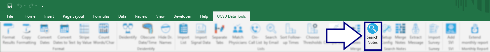
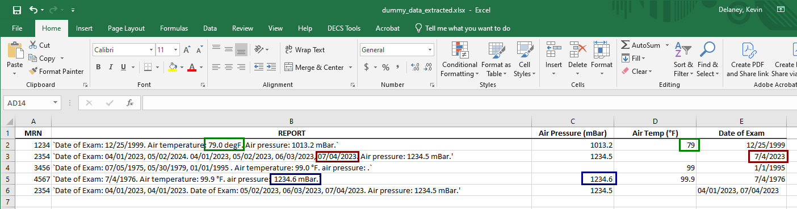

## Extract data from notes
In cases where we want to extract data from free-text columns, we can use the `Notes` tools to define & run extraction rules.

#### Cleaning
We start in the `Cleaning` tab, defining cleaning rules to:
* fix misspellings
* enforce standard naming

These rules are run *before* the data extraction rules.

#### Date formats
Using the `DateFormat` tab, we can select which date format we want for output columns.

#### Extraction rules
The `Extract` tab lets us define the Regular Expressions that extract data from free text.

Starting with these free-text notes:

Here's an example of the extracted data:

Notice how the original dates--in multiple formats--were automatically converted to a standard date format before extraction.

[BACK](../../README.md)