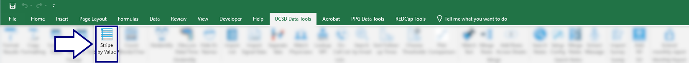
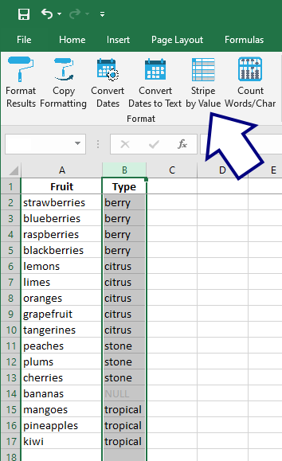
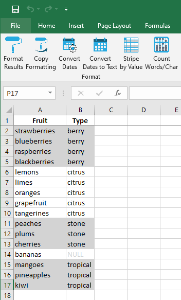

## Stripe by value

This tool groups rows by the value of the selected column.

If the spreadsheet looks like this:

...once `Stripe by Value` is pressed, it will look like this:

[BACK](../../README.md)