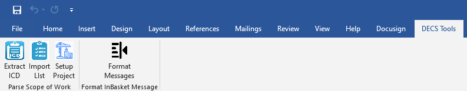
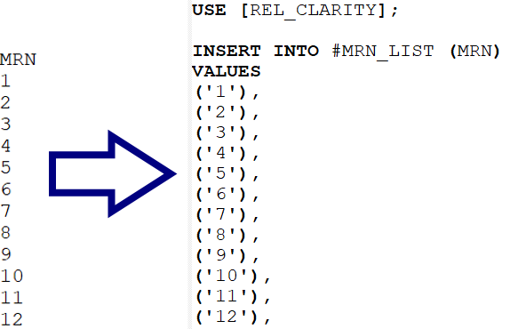
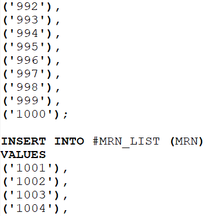

# Word Add-Ins

Creates custom buttons in Microsoft Word that allow user to:
* Scan a Scope of Work (SoW) file & create SQL code that searches for the ICD-9/ICD-10 codes and names listed in the SoW.
* Turn a list of MRNs or ICDs into a SQL snippet that imports the list into a query.
* Setup a DECS project using the info in a Scope of Work file:
    - Build the DECS project directory.
    - Initialize the Excel output file, including disclaimer.
    - Initialize the SQL file.
    - Modify a Slicer/Dicer SQL file to include patient consent, etc.
    - Push the SQL file to GitLab.
    - Creates a project folder in Outlook.
    - Draft the completion email.
* Format extracted InBasket messages to facilitate human review.

### Word: Build List Import
When researchers provide lists of Medical Record Numbers (MRNs) or International Classification of Diseases (ICD) codes to be used in a report, those lists need to be imported into SQL. Pressing the `Import List` button converts a list into SQL code which can be referenced in a query to import them:

Since there is a limit on the number of values (1000) that can be inserted in one statement, the app automatically breaks up the insertion into multiple statements:

